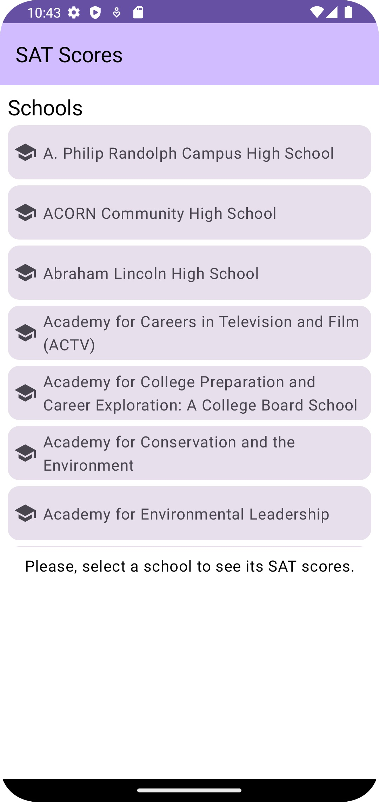
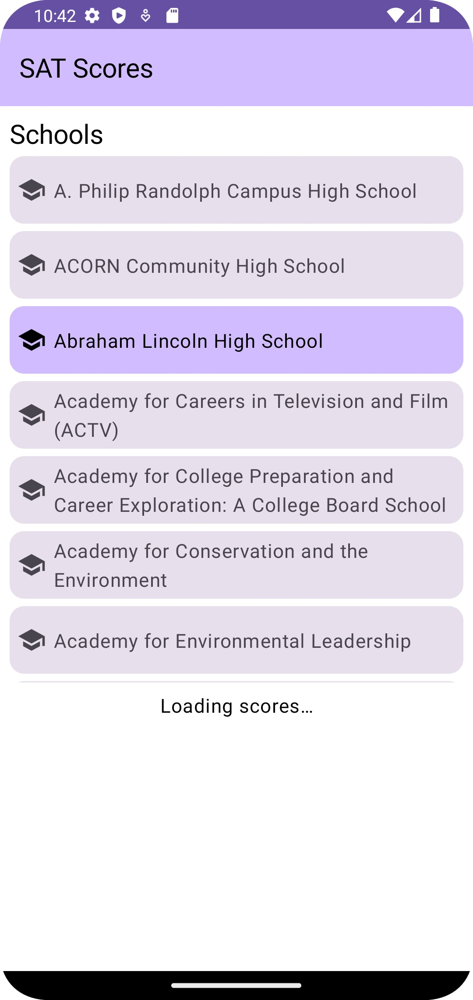
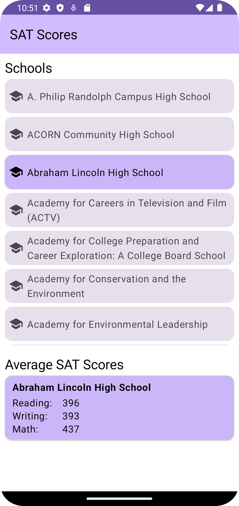

# 20230315-AntonSpaans-NYCSchools

Application that has one screen that shows a list of NYC area schools and allows the user to select a school, 
which causes the average SAT scores (reading, writing, math) to be shown.

This has been done:
- Simple one activity/screen UI.
- Happy paths only on UI so far.
- Unit tests for SchoolDomain

To be done:
- Add Unit tests for SchoolViewModel
 
To be done optionally:
- Add an Espresso/Compose test for at least one scenario.

# UI

UI is generated using JetPack Compose UI and ViewModels emitting through StateFlows (MVVM).

# Dependency Injection and Inversion

Dependency inversion is used and dependencies are inject **manually** at the 'edges' of the app, 
which is in the Application (SchoolApplication class) and the Activity (SchoolActivity class).

# Screenshots

